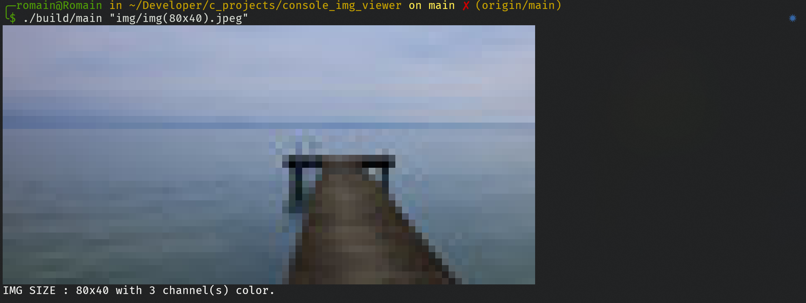
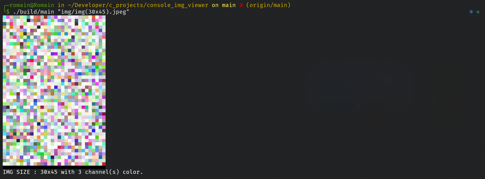

# console_img_viewer
Command line tool utility that allow you to display JPEG image directly into the console. 


<p align="center">
    
    
    <br />
    <i align="center">Screenshots of the result.</i>
</p>

# Build
you can create an executable file using the `makefile` in the project folder and executing this command:

```bash
make
```
After that, you can run the script by using the command:
```bash
./build/main <path_to_your_JPEG_image>
```

# Limitation 
Please note that the current version of this program only supports `.jpg` and `.jpeg` file formats. Additionally, if the image file is too large, it may not display correctly in the terminal, as it could exceed the available number of rows and columns. At this time, I do not plan to implement improvements for handling other formats or resizing large images. Feel free to implement it yourself! :)

# Licence
- romainflcht